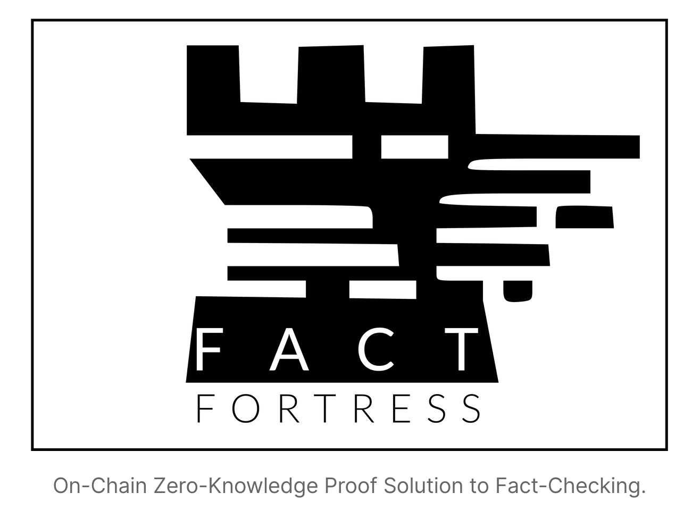
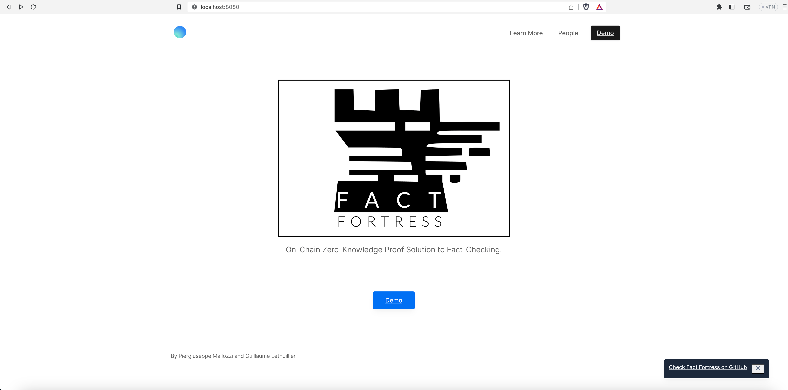

# Fact Fortress DApp



Fact Fortress is a blockchain-integrated solution that democratizes the use of zero-knowledge proofs to ensure the integrity of private data. **It provides a user-friendly interface for generating proofs off-chain through a circuit generator that leverages the Noir language and facilitates on-chain verification of the proofs on Ethereum.**
 
By enabling the validation of data integrity without revealing the data itself, our solution offers a powerful mechanism for preserving the privacy of sensitive information while ensuring the security and transparency of blockchain technology.


- [Fact Fortress DApp](#fact-fortress-dapp)
  - [Related Respositories](#related-respositories)
  - [Prerequisites](#prerequisites)
  - [Run](#run)
    - [Run the DApp](#run-the-dapp)
    - [Independently run the backend](#independently-run-the-backend)
    - [Independently run the frontend](#independently-run-the-frontend)
    - [Run the unit tests](#run-the-unit-tests)
  - [Backend End-to-End Flows](#backend-end-to-end-flows)
    - [Flow 1. Generate and Verify a Proof](#flow-1-generate-and-verify-a-proof)
      - [1 | Generate the public/private keys pair](#1--generate-the-publicprivate-keys-pair)
      - [2 | Authorize the data provider to upload its public key *(On-Chain)*](#2--authorize-the-data-provider-to-upload-its-public-key-on-chain)
      - [3 | Upload the public key *(On-Chain)*](#3--upload-the-public-key-on-chain)
      - [3b (optional) | Get the public key *(On-Chain)*](#3b-optional--get-the-public-key-on-chain)
      - [4 | Hash and Sign Data](#4--hash-and-sign-data)
      - [5 | Store the signature *(On-Chain)*](#5--store-the-signature-on-chain)
      - [6 | Generate the Proof](#6--generate-the-proof)
      - [7 | \[ZKP::Proof of Provenance\] Verify the Public Inputs *(On-Chain)*](#7--zkpproof-of-provenance-verify-the-public-inputs-on-chain)
      - [8 | \[ZKP::Proof of Provenance\] Verify the Proof of Provenance *(On-Chain)*](#8--zkpproof-of-provenance-verify-the-proof-of-provenance-on-chain)
    - [Flow 2. Manage Authorizations (NFTs)](#flow-2-manage-authorizations-nfts)
      - [1 | Check All Access Policies (Default Policy)](#1--check-all-access-policies-default-policy)
      - [2 | Check Unauthorized Data Provider's Token ID (No Token)](#2--check-unauthorized-data-providers-token-id-no-token)
      - [3 | Check Unauthorized Data Analyzer's Token ID (No Token)](#3--check-unauthorized-data-analyzers-token-id-no-token)
      - [4 | Authorize a Data Provider](#4--authorize-a-data-provider)
      - [5 | Authorize a Data Analyzer](#5--authorize-a-data-analyzer)
      - [6 | Check Authorized Data Analyzer's Token ID](#6--check-authorized-data-analyzers-token-id)
      - [7 | Check All Access Policies](#7--check-all-access-policies)

## Related Respositories

- Circuits generator: [https://github.com/pierg/fact-fortress-circuits](https://github.com/pierg/fact-fortress-circuits)
- Frontend: [https://github.com/pierg/fact-fortress-frontend](https://github.com/pierg/fact-fortress-frontend)

## Prerequisites

- NodeJS LTS [https://nodejs.org/en/download](https://nodejs.org/en/download)
- pnpm [https://pnpm.io/fr/installation](https://pnpm.io/fr/installation)
- make

Install the backend and the frontend:

```
git clone git@github.com:pierg/fact-fortress-dapp.git
cd fact-fortress-dapp && pnpm install
git clone git@github.com:pierg/fact-fortress-frontend.git
cd fact-fortress-frontend && pnpm install
```

## Run

### Run the DApp

To deploy the backend and the frontend together, run the following command from the root directory:

```
make run
```

This command launches the backend, then opens the frontend in the browser (`http://localhost:8080`).

### Independently run the backend

From the root directory, run:

```
pnpm backend
```

(By default, the backend runs on port `3000`).

A Postman collection is provided to interact with the backend: `tools/Postman_collection/Fact_Fortress.postman_collection.json`

### Independently run the frontend



*Once the backend is running* (`► server started on port 3000 ✓`), from the root directory run:

```
pnpm frontend
```

Then, open `http://localhost:8080` on your browser.

(By default, the backend runs on port `8080`).

### Run the unit tests


From the root directory, run:

```
pnpm run test
```

These tests notably contain an end-to-end flow, from the authorization of data providers to the on-chain verification of the proof of Schnorr signature.

## Backend End-to-End Flows

### Flow 1. Generate and Verify a Proof

#### 1 | Generate the public/private keys pair

*Data providers generate a private/public key pair based on the Grumpkin elliptic curve used by Noir.*

| WARNING: This action should be performed offline. This endpoint is just a helper. Data providers are expected to generate the keys themselves. |
| -------------------------------------------------------------------------------------------------------------------------------------------- |

```
GET http://localhost:3000/key_pair
```

* **Input**
    * (None)
* **Output**
    * `public_key` Public key based on the Grumpkin curve, used by Noir
    * `private_key` Random private key


*Example*

```
curl --location 'http://localhost:3000/key_pair'

{
    "public_key": "0x0dd7811f6af9d473c41376affb8660aba00e255c49844b31182f54bc0ab3e2ae1b23bd0e9afdb8275f880934b115057ed86f075048d4d8bd9fa8d92670dc6892",
    "private_key": "ca1a2b52a7405f06f71c03cbaada78559aa86a0e2d01321540012f3762a12818"
}
```

- - -

#### 2 | Authorize the data provider to upload its public key *(On-Chain)*

*Data providers have to be authorized to upload their public keys on the blockchain (otherwise, anyone could do it). To do so, an NFT-based mechanism is used. The owner of the NFT smart contract has to authorize data providers once by sending them NFTs for this purpose.*

```
GET http://localhost:3000/authorize_provider
```

* **Caller**
    * Owner of the contract
* **Input**
    * (Header) `from: owner` Only the owner of the contract can mint
    * (Parameter) `address` Address of the data provider about to receive the NFT
* **Output**
    * `address` Address of the data provider having received the NFT
    * `token_id` NFT token ID


*Example*

```
curl --location 'http://localhost:3000/authorize_provider?address=0x98526c571e324028250B0f5f247Ca4F1b575fadB' \
--header 'from: owner'

{
    "address": "0x98526c571e324028250B0f5f247Ca4F1b575fadB",
    "token_id": "1"
}
```

- - -

#### 3 | Upload the public key *(On-Chain)*

*Data providers upload their public key (for the first time or when they generate a new one). This process enables the verification of the public inputs in the context of the proof of provenance.*

```
PUT http://localhost:3000/publickey
```

* **Caller**
    * Provider
* **Input**
    * (Header) `from: owner` Only the data provider owner of an NFT can upload its public key
    * (Parameter) `name` Name associated with the public key
    * (Parameter) `public_key` Grumpkin-based public key
* **Output**
    * `name` Name associated with the public key
    * `public_key` Grumpkin-based public key
    * `public_key_version` Version of the public key


*Example*

```
curl --location --request PUT 'http://localhost:3000/publickey?name=ABC&public_key=0x0dd7811f6af9d473c41376affb8660aba00e255c49844b31182f54bc0ab3e2ae1b23bd0e9afdb8275f880934b115057ed86f075048d4d8bd9fa8d92670dc6892' \
--header 'from: providerA'

{
    "name": "ABC",
    "public_key": "0x0dd7811f6af9d473c41376affb8660aba00e255c49844b31182f54bc0ab3e2ae1b23bd0e9afdb8275f880934b115057ed86f075048d4d8bd9fa8d92670dc6892",
    "public_key_version": "0"
}
```

- - -

#### 3b (optional) | Get the public key *(On-Chain)*

*Using this endpoint, anyone (including the verifiers) can get the public keys of data providers.*

```
GET http://localhost:3000/publickey
```

* **Caller**
    * Anyone
* **Input**
    * (Parameter) `name` Name associated with the public key
    * (Parameter) `version` Version of the public key
* **Output**
    * `public_key` Grumpkin-based public key


*Example*

```
curl --location 'http://localhost:3000/publickey?name=ABC&version=0'

{
    "public_key": "0x0dd7811f6af9d473c41376affb8660aba00e255c49844b31182f54bc0ab3e2ae1b23bd0e9afdb8275f880934b115057ed86f075048d4d8bd9fa8d92670dc6892"
}
```

- - -

#### 4 | Hash and Sign Data

*Data providers have to (SHA-256) hash and sign (using the Grumpkin elliptic curve) the Data.*

| WARNING: This action should be performed offline. This endpoint is just a helper. Data providers are expected to hash and sign the Data themselves. |
| ------------------------------------------------------------------------------------------------------------------------------------------------- |

```
POST http://localhost:3000/sign_message
```

* **Input**
    * (Body) `private_key` Private key associated with the public key that will be used for the proof
    * (Body) `message` Data to hash and sign
* **Output**
    * `hash` SHA-256 hash of the data (hex)
    * `signature` Signature of the hash (bytes)


*Example*

```
curl --location 'http://localhost:3000/sign_message' \
--header 'Content-Type: application/json' \
--data '{
    "private_key": "ca1a2b52a7405f06f71c03cbaada78559aa86a0e2d01321540012f3762a12818",
    "message": {
        "patient_id_0": {
            "genetic_data": {
                "rs10757274": "AA",
                "rs562556": "AA",
                "rs429358": "TT",
                "rs7412": "TT",
                "rs1801133": "TT"
            },
            "name": "Charlie"
        },
        "patient_id_1": {
            "genetic_data": {
                "rs10757274": "GG",
                "rs562556": "AG",
                "rs429358": "TT",
                "rs7412": "CT",
                "rs1801133": "TT"
            },
            "name": "Alice"
        }
    }
}'

{
    "hash": "e51b88c9ef2ee7a084f676a4d07313895e2850f6789e1bb1aa9845c3d2dd6dea",
    "signature": [
        30,
        149,
        144,
        . . .
        10,
        179,
        103
    ]
}
```

- - -

#### 5 | Store the signature *(On-Chain)*

*Data providers store the signature on the blockchain. That enables the verification of the proof of provenance.*

```
GET http://localhost:3000/upload_signature
```

* **Caller**
    * Provider
* **Input**
    * (Parameter) `public_key` Grumpkin-based public key
    * `signature` Signature of the hash (bytes)
* **Output**
    * `stored` Status: `true` if the signature has been stored, `false` otherwise


*Example*

```
curl --location 'http://localhost:3000/upload_signature?public_key=0x077418dea85cb9695990062d64d4d4add4a4d8cbbed3a5f9e5d5f299766bcdf22a10a3540173df59a3e03533011d867c7a8d879dc3819c8c4857ef3a04a6b103' \
--header 'from: ProviderA' \
--header 'Content-Type: application/json' \
--data '{
    "hash": "e51b88c9ef2ee7a084f676a4d07313895e2850f6789e1bb1aa9845c3d2dd6dea",
    "signature": [
        30,
        149,
        144,
        . . .
        10,
        179,
        103
    ]
}'

{
    "stored": true
}
```

- - -

#### 6 | Generate the Proof

*Data analyzers generate the proof (should be done online).*

| WARNING: This action should be performed offline. This endpoint is just a helper. Data analyzers are expected to generate the proofs themselves. |
| ---------------------------------------------------------------------------------------------------------------------------------------------- |

```
POST http://localhost:3000/generate_proof
```

* **Input**
    * (Parameter) `public_key` Grumpkin-based public key
    * (Body) `hash` Data hash (hex; copied from step 4)
    * (Body) `signature` Signature of the hash (bytes; copied from step 4)
* **Output**
    * Proof (bytes)


*Example*

```
curl --location 'http://localhost:3000/generate_proof?public_key=0x0dd7811f6af9d473c41376affb8660aba00e255c49844b31182f54bc0ab3e2ae1b23bd0e9afdb8275f880934b115057ed86f075048d4d8bd9fa8d92670dc6892' \
--header 'Content-Type: application/json' \
--data '{
    "hash": "e51b88c9ef2ee7a084f676a4d07313895e2850f6789e1bb1aa9845c3d2dd6dea",
    "signature": [
        30,
        149,
        144,
        . . .
        10,
        179,
        103
    ]
}'

[
    13,
    215,
    129,
    . . .
    71,
    13,
    23
]
```

- - -

#### 7 | [ZKP::Proof of Provenance] Verify the Public Inputs *(On-Chain)*

*Verifiers verify the public inputs of the proof of provenance. This is a preliminary step to the verification of the proof of provenance itself (step 8). This step ensures that the data analyzer has used the expected public key and signature as public inputs. It can also be performed off-chain.*

```
POST http://localhost:3000/verify_public_inputs
```

* **Input**
    * (Parameter) `public_key` Grumpkin-based public key
    * (Body) Proof (bytes)
* **Output**
    * `public_input_match`: `true` (public inputs match) or `false` (public inputs do not match)


*Example*

```
curl --location 'http://localhost:3000/verify_public_inputs?public_key=0x0dd7811f6af9d473c41376affb8660aba00e255c49844b31182f54bc0ab3e2ae1b23bd0e9afdb8275f880934b115057ed86f075048d4d8bd9fa8d92670dc6892' \
--header 'Content-Type: application/json' \
--data '[
    13,
    215,
    129,
    . . .
    71,
    13,
    23
]'

{
    "public_input_match": true
}
```

- - -

#### 8 | [ZKP::Proof of Provenance] Verify the Proof of Provenance *(On-Chain)*

*Verifiers verify the proof of provenance that ensures that the Data comes from a data provider.*

```
POST http://localhost:3000/verify_public_inputs
```

* **Input**
    * (Body) Proof (bytes)
* **Output**
    * `valid_proof_of_provenance`: `true` (valid proof) or `false` (invalid proof)

*Example*

```
curl --location 'http://localhost:3000/verify_proof' \
--header 'Content-Type: application/json' \
--data '[
    13,
    215,
    129,
    . . .
    71,
    13,
    23
]'

{
    "valid_proof_of_provenance": true
}
```

### Flow 2. Manage Authorizations (NFTs)

| WARNING: Before running this flow, ensure to reset the accounts and authorizations using the frontend helper (implemented for demonstrations purposes only): `GET http://localhost:3000/reset_accounts` |
| ------------------------------------------------------------------------------------------------------------------------------------------------------------------------------------------------------- |


#### 1 | Check All Access Policies (Default Policy)

*Get registered access policies when no data analyzer has been authorized yet: only the default access policy is returned.*

```
GET http://localhost:3000/all_access_policies
```

* **Input**
    * (None)
* **Output**
    * `access_policies` List of *all* registered data policies


*Example*

```
curl --location 'http://localhost:3000/all_access_policies'

{
    "access_policies": [
        "default_policy"
    ]
}
```

- - -


#### 2 | Check Unauthorized Data Provider's Token ID (No Token)

*An unauthorized data provider has no token ID*

```
GET http://localhost:3000/provider_token_id
```

* **Input**
    * (parameter) `address` Address of the data provider
* **Output**
    * `error` When the data provider is unauthorized: `Address does not have a token`


*Example*

```
curl --location 'http://localhost:3000/provider_token_id?address=0x98526c571e324028250B0f5f247Ca4F1b575fadB'

{
    "error": "Address does not have a token"
}
```

- - -

#### 3 | Check Unauthorized Data Analyzer's Token ID (No Token)

*An unauthorized data analyzer has no token ID*

```
GET http://localhost:3000/analyzer_token_id
```

* **Input**
    * (parameter) `address` Address of the data provider
* **Output**
    * `error` When the data provider is unauthorized: `Address does not have a token`


*Example*

```
curl --location 'http://localhost:3000/analyzer_token_id?address=0x5455280E6c20A01de3e846d683562AdeA6891026'

{
    "error": "Address does not have a token"
}
```

- - -

#### 4 | Authorize a Data Provider

*Authorize a data provider*

```
GET http://localhost:3000/authorize_provider
```

* **Input**
    * (header) `from: owner` Only the owner of the smart contract can call the underlying function
    * (parameter) `address` Address of the data provider
* **Output**
    * `address` Address of the data provider
    * `token_id` ID of the NFT sent to the data provider


*Example*

```
curl --location 'http://localhost:3000/analyzer_token_id?address=0x5455280E6c20A01de3e846d683562AdeA6891026'

{
    "address": "0x98526c571e324028250B0f5f247Ca4F1b575fadB",
    "token_id": "1"
}
```

- - -

#### 5 | Authorize a Data Analyzer

*Authorize a data analyzer with a set of access policies*

```
POST http://localhost:3000/authorize_analyzer
```

* **Input**
    * (header) `from: owner` Only the owner of the smart contract can call the underlying function
    * (parameter) `address` Address of the data analyzer
    * (body) `access_policies` Set of access policies for this data analyzer
* **Output**
    * `address` Address of the data provider
    * `token_id` ID of the NFT sent to the data provider

*Example*

```
curl --location 'http://localhost:3000/authorize_analyzer?address=0x5455280E6c20A01de3e846d683562AdeA6891026' \
--header 'from: owner' \
--header 'Content-Type: application/json' \
--data '{
    "access_policies": [
        "TYPE_A",
        "TYPE_B",
        "TYPE_C",
    ]
}'

{
    "address": "0x98526c571e324028250B0f5f247Ca4F1b575fadB",
    "token_id": "1"
}
```

- - -

#### 6 | Check Authorized Data Analyzer's Token ID

*Now that the data analyzer has been approved, her token ID can be retrieved*

```
GET http://localhost:3000/analyzer_token_id
```

* **Input**
    * (parameter) `address` Address of the data analyzer
* **Output**
    * `address` Address of the data analyzer
    * `token_id` ID of the NFT sent to the data provider
    * `access_policies` Set of access policies for this data analyzer
  
*Example*

```
curl --location 'http://localhost:3000/analyzer_token_id?address=0x5455280E6c20A01de3e846d683562AdeA6891026'

{
    "address": "0x5455280E6c20A01de3e846d683562AdeA6891026",
    "token_id": "1",
    "access_policies": [
        "TYPE_A",
        "TYPE_B",
        "TYPE_C",
    ]
}
```

- - -

#### 7 | Check All Access Policies

*Now that at least on data analyzer has been authorized, the set of all access policies has been updated by the smart contract*

```
GET http://localhost:3000/all_access_policies
```

* **Input**
    * (None)
* **Output**
    * `access_policies` List of *all* registered data policies


*Example*

```
curl --location 'http://localhost:3000/all_access_policies'

{
    "access_policies": [
        "default_policy",
        "TYPE_A",
        "TYPE_B",
        "TYPE_C",
    ]
}
```

